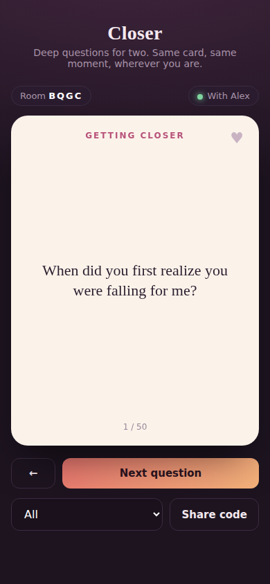
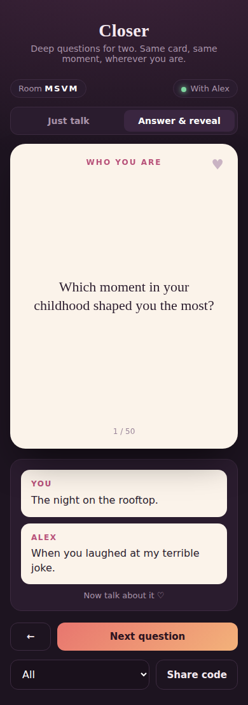

# Closer: deep questions for couples

 

Two partners join the same room with a 4-letter code and see the same card at the same moment.
There are two modes, and either partner can switch between them:
- **Just talk**: you only see the questions. Good for a call or sitting together.
- **Answer & reveal**: each of you writes an answer privately, and both answers appear once you've both locked in.

**Accounts (optional):** sign up with email and password, then link with your partner once using a 6-letter code. After that you both land in your own private room, and your answers and favorites are saved. Guests can still play with a room code, without saving anything.

Either partner can flip the card, go to the next or previous question, switch category, or save a favorite, and the other sees it instantly.

## Run it
```
npm install
npx wrangler dev      # http://localhost:8787
```
Open it on two devices (same Wi-Fi: use your computer's local IP), tap "Play as a guest", start a room and share the code.
For accounts locally, put `SUPABASE_URL`, `SUPABASE_ANON_KEY` and `CLOSER_DB_KEY` in a `.dev.vars` file.

## What's in it
- `worker/index.js`: the Cloudflare Worker. Each room is a Durable Object; both partners hold a WebSocket to it and every tap is broadcast to both. Max 2 people per room.
- `worker/game.js`: the game rules (deck order, flip, answers, favorites). `worker/db.js`: calls the account functions in Supabase.
- `public/index.html`: the whole app (lobby, flip card, controls), mobile-first.
- `supabase/schema.sql`: accounts, partner links, saved answers and favorites.
- `questions.json`: starter deck, 50 questions across 5 categories. Edit freely.
- `server.js` + `supabase.js` + `render.yaml`: the older Node version for Render, kept until the Cloudflare move is done.

## Admin dashboard
`/admin` shows live and total numbers (people in rooms right now, sign-ups, couples, answers, the most answered and favorited questions), every account, and every couple's answers. Admins can set a new password for someone, sign them out everywhere, unlink a couple, delete an account, or make someone else an admin.
An account is an admin when `profiles.is_admin` is set: promote the first one in the Supabase SQL editor once that account exists (see `supabase/migrations/20260925_admin_by_account.sql`), and admins can promote others from the dashboard. Admin is never granted by email alone, because sign-up doesn't verify emails. Admins see an "Admin dashboard" link after logging in.

## Roadmap
1. **Prototype (this)**: pairing by code, synced card, flip, next/back, categories, shared favorites.
2. **Real product**: accounts so a couple stays paired, saved history of answered questions, rooms that survive a server restart (database such as Supabase or Firebase), hosting on a public URL.
3. **Mobile app**: wrap as a React Native / Expo app or a PWA, push notifications ("your partner is waiting on a card"), a daily question.
4. **Depth features**: voice notes, question packs (long distance, newlyweds, spicy), streaks.

## Accounts setup
Accounts turn on when these environment variables are set (without them the app runs guest-only):
- `SUPABASE_URL`, `SUPABASE_ANON_KEY`: from the Supabase project's API settings.
- `CLOSER_DB_KEY`: any long random secret. Store the same value in the database with the line at the top of `supabase/schema.sql`, after running that file in the Supabase SQL editor.

## Deploy (free, Cloudflare)
1. Cloudflare dashboard → Workers & Pages → Create → Import a repository → pick this repo → Deploy. Every push to `main` redeploys.
2. Worker → Settings → Variables and Secrets → add secret `CLOSER_DB_KEY` (same value as in the database).

`SUPABASE_URL` and `SUPABASE_ANON_KEY` are public and already in `wrangler.jsonc`. Workers and Durable Objects don't sleep, and rooms survive restarts.
