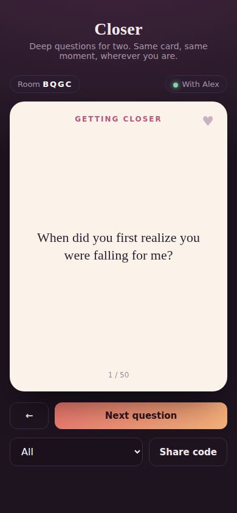
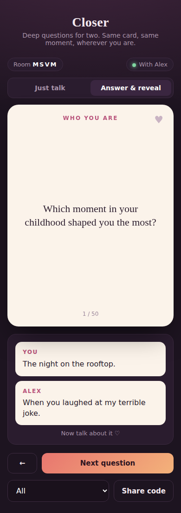

# Closer: deep questions for couples

 

Two partners join the same room with a 4-letter code and see the same card at the same moment.
There are two modes, and either partner can switch between them:
- **Just talk**: you only see the questions. Good for a call or sitting together.
- **Answer & reveal**: each of you writes an answer privately, and both answers appear once you've both locked in.
- **Tap to reveal** (on by default): each new card starts face down until one of you taps it. Turn it off and every card arrives face up; moving to the next card still moves both of you.
- **Decks**: before you start, pick one deck, a few, or all of them. The room remembers where you are in each set of decks, so switching away and back picks up at the same card. A couple's room keeps this for a year; a guest room for 6 hours.
- **Only new cards** (accounts only): a switch in the deck picker deals just the cards the couple hasn't seen yet. A card counts as seen once it has been shown face up or answered.
- **Staying signed in**: you stay signed in until you log out. Besides the token in local storage, the sign-in lives in an HttpOnly cookie (renewed on every visit) that browsers like Safari don't wipe; the cookie is only accepted for `GET /api/me` and the room WebSocket from the same origin.

**Accounts (optional):** sign up with email and password, then link with your partner once using a 6-letter code. After that you both land in your own private room, and your answers and favorites are saved. Guests can still play with a room code, without saving anything.

Either partner can flip the card, go to the next or previous question, switch category, or save a favorite, and the other sees it instantly.

## Run it
Use Node.js 22 or newer.
```
npm ci
npm start            # http://localhost:8787
```
Open two browser windows, tap "Play as a guest", start a room and share the code. To use two devices on the same Wi-Fi, run `npm start -- --ip 0.0.0.0` and use your computer's local IP.
For accounts locally, put `SUPABASE_URL`, `SUPABASE_ANON_KEY` and `CLOSER_DB_KEY` in a `.dev.vars` file.
Use a separate Supabase development project when testing accounts; the checked-in URL is production. Without `CLOSER_DB_KEY`, local development is guest-only.

## Checks
```
npm test             # Worker/game/browser regressions
npm run test:db      # isolated temporary PostgreSQL regression database
npx wrangler deploy --dry-run
```
The database checks need PostgreSQL with `pgcrypto` and never use the production database. Put `initdb`, `pg_ctl`, and `psql` on your `PATH` before running them.

## What's in it
- `worker/index.js`: the Cloudflare Worker. Each room is a Durable Object; both partners hold a WebSocket to it and every tap is broadcast to both. Max 2 people per room.
- `worker/game.js`: the game rules (deck order, flip, answers, favorites). `worker/db.js`: calls the account functions in Supabase.
- `public/index.html`: the whole app (lobby, flip card, controls), mobile-first.
- `worker/room-storage.js`: stores individual answers and deck progress separately to stay within Durable Object value limits.
- `supabase/migrations/`: authoritative database history. `supabase/schema.sql` is the original bootstrap; apply subsequent migrations in order for a new environment.
- `questions.json`: 1,378 questions across 26 decks. Always add new questions at the end of a deck. To remove one, replace it with `null` rather than deleting it: cards are numbered by their place in the deck, and saved answers and progress refer to those numbers.

The obsolete Node/Render server was retired because it used a different transport from the current app. Cloudflare Wrangler is the supported local and production runtime.

## Reliable saves and session changes
Answer and favorite commands use protocol version 2: each carries a unique command ID, the displayed card ID, and the room's data generation. The server acknowledges after durable storage, retries Supabase writes in order, and deduplicates reconnect retries. Explicit data deletion increments the generation so old pending commands cannot recreate deleted answers.

Drafts remain in memory when changing questions, modes, or reconnecting. They are cleared when signing out and are not persisted across a page reload. Returning to an unsent question restores its draft.

Couple sockets revalidate authentication and the partner relationship before accepting actions or sending private state. Unlinking rotates both invitation codes; previous codes cannot reconnect a former partner. Clients that predate protocol 2 must refresh or install the compatible mobile update before saving.

## Admin dashboard
`/admin` shows live and total numbers (people in rooms right now, sign-ups, couples, answers, the most answered and favorited questions), account details, and each couple's answer and favorite counts. It does not expose written answers, invite codes, guest room join codes, or account passwords. Admins can sign someone out everywhere, unlink a couple, delete an account, or make someone else an admin. The Rooms tab lists open guest and couple rooms with who's in them; admins can remove a person, close a room, or close all guest rooms. On the Couples tab they can delete all of a couple's saved answers and favorites.
An account is an admin when `profiles.is_admin` is set: promote the first one in the Supabase SQL editor once that account exists (see `supabase/migrations/20260925210759_admin_by_account_only.sql`), and admins can promote others from the dashboard. Admin is never granted by email alone, because sign-up doesn't verify emails. Admins see an "Admin dashboard" link after logging in.

## Further product work
The native Expo app is maintained on the `mobile-apps` branch. A browsable saved-answer library, purchase entitlement flow, account recovery, and end-to-end encryption require separate product and security designs.

## Accounts setup
Accounts turn on when these environment variables are set (without them the app runs guest-only):
- `SUPABASE_URL`, `SUPABASE_ANON_KEY`: from the Supabase project's API settings.
- `CLOSER_DB_KEY`: any long random secret. Store the same value in the database with the line at the top of `supabase/schema.sql`, after running that file in the Supabase SQL editor.

## Deploy (free, Cloudflare)
1. Cloudflare dashboard → Workers & Pages → Create → Import a repository → pick this repo → Deploy. Every push to `main` redeploys.
2. Worker → Settings → Variables and Secrets → add secret `CLOSER_DB_KEY` (same value as in the database).

`SUPABASE_URL` and `SUPABASE_ANON_KEY` are public and already in `wrangler.jsonc`. Workers and Durable Objects don't sleep, and rooms survive restarts.
